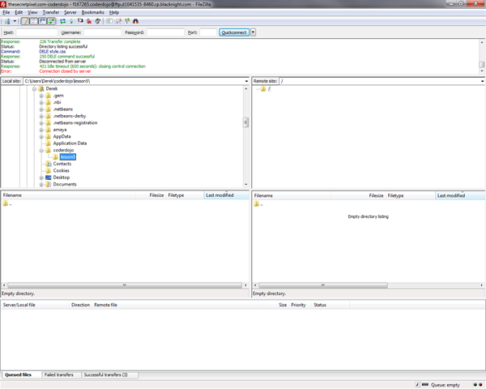
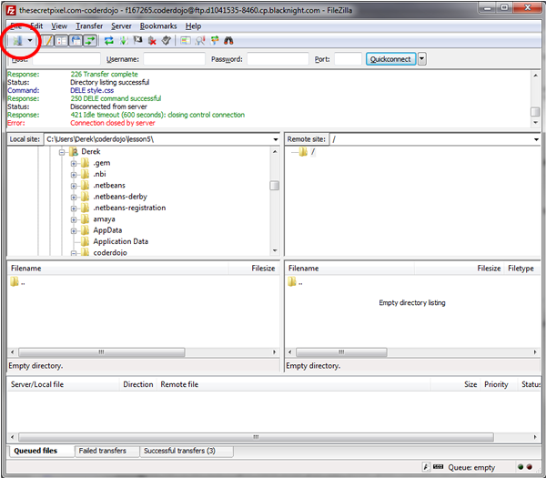
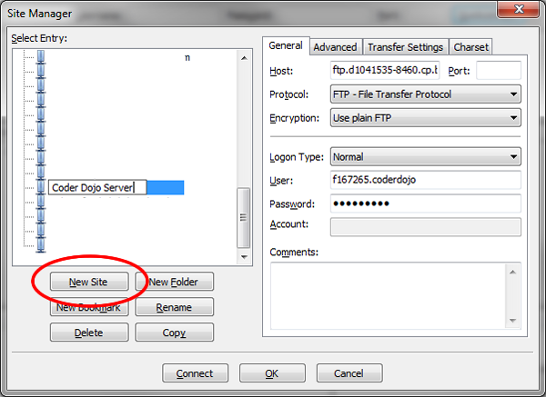
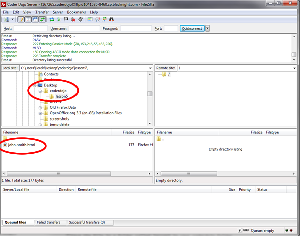
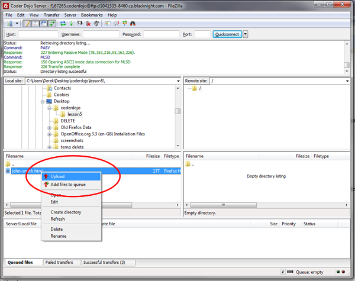
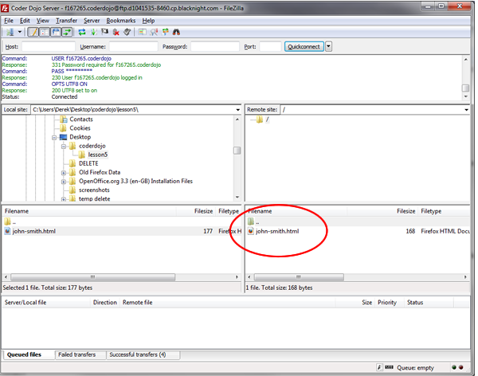

---

layout: lesson
title: Yellow Belt - Lesson 5

---

# Lesson 5

## Introduction

We are going to learn how to transfer files from your computer to a web server.

FTP

**FTP** stands for **File Transfer Protocol**. This is one of the methods is used to transfer files from computer to computer. Web developers use it to transfer files from their own computer to a web server. In this lesson we will learn how to transfer files from your own computer to a web server.

## FTP Client

To use FTP you need an FTP client. In computer science a client is a program that accesses a server. So we will be using an FTP client to access an FTP Server. You will start with files on your computer and you will *FTP* them up to the server.

There are lots of FTP client programs. A good free one is called Filezilla. You can
get Filezilla here --> <a href="http://filezilla-project.org/">http://filezilla-project.org/</a>

Download it and install it onto your computer. When it is installed open it up and your will see a window like this.

The left hand side of the window shows you files that are on your computer and the right hand side of the window shows you the files that are on the server. You wont see any files on the right hand side because you are not connected to the server yet.

## Connecting to the Server

So how do you connect to the server? You need connection details. For every connection to a server you will need 3 things:

1.Hostname 
2.Username
3.Password

**Hostname** is the name of the server that you want to FTP your files to. This can be a name like **ftp.myserver.com** or an IP address like **101.101.111.122**. Don't worry about what an IP address is for now. You will learn more about that in another lesson. For now all you need to know is that your host name can be an IP address.

**Username** is just a name that the server recognises. This is just like your username for Gmail or Facebook only it is for the FTP server.

**Password** is just a password. This is to stop people who shouldn't have access to your server from FTPing files to it. If you have your own server you should always make sure that our FTP password is something hard to guess and you must only ever give the password to people that you trust. Web sites can be hacked by people who simply guess passwords.

So if you have your FTP client and your hostname, username and password you are ready to FTP files up to the server.

In Filezilla click the button circled in the screen shot below.

Click the "New Site" button.

Give it a name that makes sense like "Coder Dojo Server". On the right hand side you can enter your connection details

## Connection Details
Copy and paste these values in

Hostname --> **ftp.d1041535-8460.cp.blacknight.com**  
Username --> **f167265.coderdojo**  
Password --> **coderdojo**

To connect to the server do the following

1. Enter in the hostname above in the "**Host**" field
2. For Protocol select "**FTP File Transfer Protocol **"
3. For Encryption select "**Use plain FTP**"
4. For Logon Type select "**Normal**"
5. Enter in the username in the "**User**" field
6. Enter in the password in the "**Password**" field

Don't worry if this sounds complicated just follow the steps and it will work.

Then all you have to do is click *Connect*. If you entered everything correctly you will see folders on the right hand side. These are folders on the server where you can put your files. If you put them in the right place you will be able to see them on the web.

## Creating your first web page on the Web

Now that you are connected you can upload a file up to the server.

Open a new file in your text editor. Save the file as your-name.html. So if you are called John Smith create a file called john-smith.html. Open up the file and type

    <!DOCTYPE html>
    <html>
        <head>
              <title>First Page on the Web!!</title>
        </head>
        <body>
              <h1>Hello World!!</h1>
              
This is my first web page on the Web!!

        </body>
    </html>

Save the file in a folder called lesson5 in your coderdojo folder.

## Uploading your web page

In Filezilla on the left hand side find the file that you just saved like in the screen shot below.

Right click the file and click "upload". The file should then be transferred to the server in a couple of seconds.

No you should see the following -->

## View your web page

Now you can go to your your web page and anyone with a web connection can see it too.

<a href="http://www.thesecretpixel.com/coderdojo/john-smith.html">http://www.thesecretpixel.com/coderdojo/<strong>john-smith.html</strong></a>

Just change the name of the file to the name of the file that you uploaded.

Now you have your first web page actually on the web.

## Conclusion

What you have learned today are the basics of using an FTP client. You can try uploading images and other HTML files.

## Resources

While writing HTML code you may forget a particular tag or not sure about a tags attributes. There are a many resources on the internet to help you find the answers.

The following are some good web sites to help you find the answers.

* [http://filezilla-project.org/](http://filezilla-project.org/)
* [http://en.wikipedia.org/wiki/File_Transfer_Protocol](http://en.wikipedia.org/wiki/File_Transfer_Protocol)
